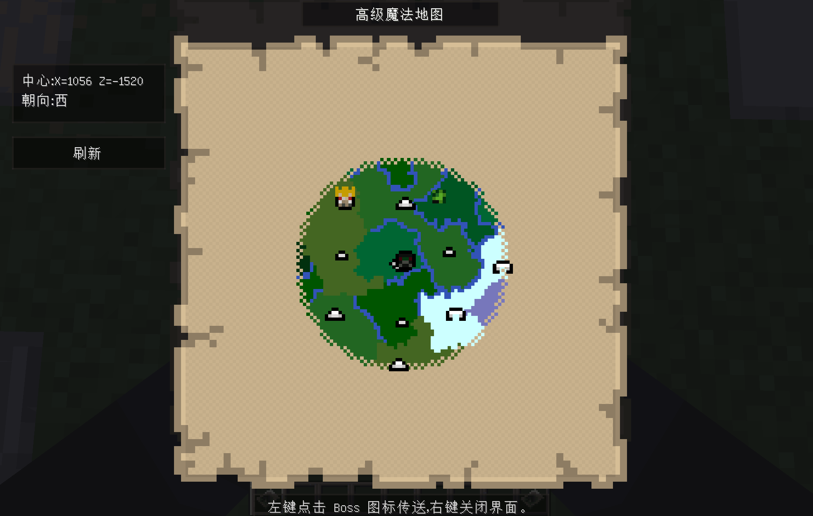

# Twilight Forest Addons for Minecraft 1.7.10

An addon for The Twilight Forest focused on better map-based exploration and boss travel on Minecraft 1.7.10 Forge.

简体中文| [English](#english)

## 简体中文

本mod是1.7.10的暮色森林附属模组，核心目标是增强魔法地图的探索与传送体验。

### 内容

- 高级魔法地图
- 可交互的地图GUI
- 点击Boss图标传送
- 可选的暮色进度限制（禁止传送至进度没到的boss）
- 安全传送（祖传
- 强大的地图渲染刷新

本mod需要暮色森林作为前置

## English

This mod adds an advanced magic map system on top of Twilight Forest's original magic map mechanics.

### Features

- Advanced Magic Map
- Large interactive map GUI
- Clickable boss icons for teleportation
- Optional progression-aware teleport restrictions
- Safe teleport
- better map refresh after teleport

Twilight Forest is a required dependency.

